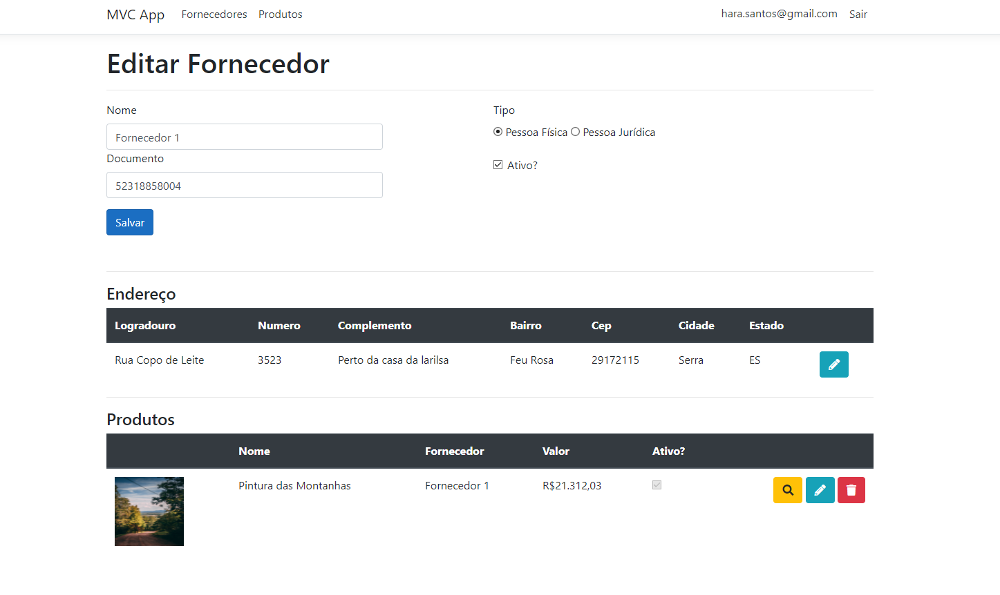

# devio-mvc-dotnet-5
Aplicação [.NET 5](https://docs.microsoft.com/pt-br/dotnet/core/dotnet-five) [MVC](https://docs.microsoft.com/pt-br/aspnet/mvc/overview/getting-started/introduction/getting-started) com utilização de [Razor Pages](https://docs.microsoft.com/pt-br/aspnet/core/tutorials/razor-pages/razor-pages-start?view=aspnetcore-5.0&tabs=visual-studio) para apresentação das views. Basicamente a aplicação é dividida em três camadas: **App** (apresentação dos dados), **Business** (lógica de negócio) e **Data** (acesso a dados).

<figure>
    
</figure>

Link de hospedagem da aplicação realizada na plataforma [Azure](https://azure.microsoft.com/pt-br/): https://deviomvc.azurewebsites.net
